## Instructions
Answer the following questions and complete the exercises in RMarkdown. Please embed all of your code and push your final work to your repository. Your code should be organized, clean, and run free from errors. Be sure to **add your name** to the author header above. You may use any resources to answer these questions (including each other), but you may not post questions to Open Stacks or external help sites. There are 10 total questions.  

Make sure to use the formatting conventions of RMarkdown to make your report neat and clean! Your plots should use consistent aesthetics throughout. Feel free to be creative- there are many possible solutions to these questions!  


## Load the libraries

```r
library(tidyverse)
```

```
## ── Attaching packages ─────────────────────────────────────── tidyverse 1.3.0 ──
```

```
## ✓ ggplot2 3.2.1     ✓ purrr   0.3.3
## ✓ tibble  3.0.4     ✓ dplyr   1.0.2
## ✓ tidyr   1.1.2     ✓ stringr 1.4.0
## ✓ readr   1.3.1     ✓ forcats 0.5.0
```

```
## Warning: package 'tibble' was built under R version 3.6.2
```

```
## Warning: package 'tidyr' was built under R version 3.6.2
```

```
## Warning: package 'dplyr' was built under R version 3.6.2
```

```
## ── Conflicts ────────────────────────────────────────── tidyverse_conflicts() ──
## x dplyr::filter() masks stats::filter()
## x dplyr::lag()    masks stats::lag()
```

```r
library(janitor)
```

```
## Warning: package 'janitor' was built under R version 3.6.2
```

```
## 
## Attaching package: 'janitor'
```

```
## The following objects are masked from 'package:stats':
## 
##     chisq.test, fisher.test
```

```r
library(here)
```

```
## Warning: package 'here' was built under R version 3.6.2
```

```
## here() starts at /Users/AnthonyWeidner/Desktop/BIS15LFinalProject_Group1
```

```r
options(scipen=999) #disables scientific notation when printing
library(ggthemes)
```

```
## Warning: package 'ggthemes' was built under R version 3.6.2
```

```r
library(skimr)
```

```
## Warning: package 'skimr' was built under R version 3.6.2
```

```r
library(shiny)
```

```
## Warning: package 'shiny' was built under R version 3.6.2
```

```r
library(shinydashboard)
```

```
## 
## Attaching package: 'shinydashboard'
```

```
## The following object is masked from 'package:graphics':
## 
##     box
```

### Import the data set from publically available United Kingdom hospitals. Please refer to the Works Cited page on the presentation for a list of all resources that were used in the project.

```r
cancer_general_data <- readr::read_csv("data/GDO_data_wide.csv")
```

```
## Parsed with column specification:
## cols(
##   .default = col_character(),
##   Incidence = col_double(),
##   Population = col_double(),
##   `Incidence Rate` = col_double(),
##   `Incidence Rate LCI (95%)` = col_double(),
##   `Incidence Rate UCI (95%)` = col_double()
## )
```

```
## See spec(...) for full column specifications.
```

```r
cancer_general_data <- janitor::clean_names(cancer_general_data)
cancer_general_data
```

```
## # A tibble: 4,744 x 161
##    cancer_site year  tumour_type tumour_type_2 tumour_type_3 basis_of_diagno…
##    <chr>       <chr> <chr>       <chr>         <chr>         <chr>           
##  1 Bladder, U… 2013  All         All           All           Not split by Ba…
##  2 Bladder, U… 2013  Renal Pelv… All           All           Not split by Ba…
##  3 Bladder, U… 2013  Renal Pelv… Malignant an… All           Not split by Ba…
##  4 Bladder, U… 2013  Renal Pelv… Malignant an… All           Not split by Ba…
##  5 Bladder, U… 2013  Renal Pelv… Malignant an… All           Not split by Ba…
##  6 Bladder, U… 2013  Renal Pelv… Malignant an… All           Not split by Ba…
##  7 Bladder, U… 2013  Renal Pelv… Malignant an… All           Not split by Ba…
##  8 Bladder, U… 2013  Renal Pelv… Malignant an… All           Not split by Ba…
##  9 Bladder, U… 2013  Renal Pelv… Malignant an… All           Not split by Ba…
## 10 Bladder, U… 2013  Renal Pelv… Malignant an… All           Not split by Ba…
## # … with 4,734 more rows, and 155 more variables: stage <chr>,
## #   stage_detail <chr>, stage_detail_2 <chr>, age <chr>, region <chr>,
## #   sex <chr>, grade <chr>, nodal_status <chr>, incidence <dbl>,
## #   population <dbl>, incidence_rate <dbl>,
## #   incidence_rate_lci_95_percent <dbl>, incidence_rate_uci_95_percent <dbl>,
## #   ct_count <chr>, ct_cohort <chr>, ct_percentage <chr>,
## #   ct_percentage_lci_95_percent <chr>, ct_percentage_uci_95_percent <chr>,
## #   rt_count <chr>, rt_cohort <chr>, rt_percentage <chr>,
## #   rt_percentage_lci_95_percent <chr>, rt_percentage_uci_95_percent <chr>,
## #   surgery_count <chr>, surgery_cohort <chr>, surgery_percentage <chr>,
## #   surgery_percentage_lci_95_percent <chr>,
## #   surgery_percentage_uci_95_percent <chr>, ct_only_count <chr>,
## #   ct_only_cohort <chr>, ct_only_percentage <chr>,
## #   ct_only_percentage_lci_95_percent <chr>,
## #   ct_only_percentage_uci_95_percent <chr>, rt_only_count <chr>,
## #   rt_only_cohort <chr>, rt_only_percentage <chr>,
## #   rt_only_percentage_lci_95_percent <chr>,
## #   rt_only_percentage_uci_95_percent <chr>, surgery_only_count <chr>,
## #   surgery_only_cohort <chr>, surgery_only_percentage <chr>,
## #   surgery_only_percentage_lci_95_percent <chr>,
## #   surgery_only_percentage_uci_95_percent <chr>, ct_and_rt_count <chr>,
## #   ct_and_rt_cohort <chr>, ct_and_rt_percentage <chr>,
## #   ct_and_rt_percentage_lci_95_percent <chr>,
## #   ct_and_rt_percentage_uci_95_percent <chr>, surgery_and_ct_count <chr>,
## #   surgery_and_ct_cohort <chr>, surgery_and_ct_percentage <chr>,
## #   surgery_and_ct_percentage_lci_95_percent <chr>,
## #   surgery_and_ct_percentage_uci_95_percent <chr>, surgery_and_rt_count <chr>,
## #   surgery_and_rt_cohort <chr>, surgery_and_rt_percentage <chr>,
## #   surgery_and_rt_percentage_lci_95_percent <chr>,
## #   surgery_and_rt_percentage_uci_95_percent <chr>,
## #   surgery_and_ct_and_rt_count <chr>, surgery_and_ct_and_rt_cohort <chr>,
## #   surgery_and_ct_and_rt_percentage <chr>,
## #   surgery_and_ct_and_rt_percentage_lci_95_percent <chr>,
## #   surgery_and_ct_and_rt_percentage_uci_95_percent <chr>,
## #   other_care_count <chr>, other_care_cohort <chr>,
## #   other_care_percentage <chr>, other_care_percentage_lci_95_percent <chr>,
## #   other_care_percentage_uci_95_percent <chr>, initial_cohort_size <chr>,
## #   survival_cohort_size <chr>, net_survival_03m <chr>,
## #   net_survival_03m_lci <chr>, net_survival_03m_uci <chr>,
## #   crude_survival_03m <chr>, crude_survival_03m_lci <chr>,
## #   crude_survival_03m_uci <chr>, net_survival_06m <chr>,
## #   net_survival_06m_lci <chr>, net_survival_06m_uci <chr>,
## #   crude_survival_06m <chr>, crude_survival_06m_lci <chr>,
## #   crude_survival_06m_uci <chr>, net_survival_09m <chr>,
## #   net_survival_09m_lci <chr>, net_survival_09m_uci <chr>,
## #   crude_survival_09m <chr>, crude_survival_09m_lci <chr>,
## #   crude_survival_09m_uci <chr>, net_survival_12m <chr>,
## #   net_survival_12m_lci <chr>, net_survival_12m_uci <chr>,
## #   crude_survival_12m <chr>, crude_survival_12m_lci <chr>,
## #   crude_survival_12m_uci <chr>, net_survival_24m <chr>,
## #   net_survival_24m_lci <chr>, net_survival_24m_uci <chr>,
## #   crude_survival_24m <chr>, crude_survival_24m_lci <chr>,
## #   crude_survival_24m_uci <chr>, …
```


### Taking a glance at the data set.

```r
skim(cancer_general_data)
```


Table: Data summary

|                         |                    |
|:------------------------|:-------------------|
|Name                     |cancer_general_data |
|Number of rows           |4744                |
|Number of columns        |161                 |
|_______________________  |                    |
|Column type frequency:   |                    |
|character                |156                 |
|numeric                  |5                   |
|________________________ |                    |
|Group variables          |None                |


**Variable type: character**

|skim_variable                                   | n_missing| complete_rate| min| max| empty| n_unique| whitespace|
|:-----------------------------------------------|---------:|-------------:|---:|---:|-----:|--------:|----------:|
|cancer_site                                     |         0|             1|   6|  55|     0|       13|          0|
|year                                            |         0|             1|   4|   9|     0|        8|          0|
|tumour_type                                     |         0|             1|   3|  63|     0|       34|          0|
|tumour_type_2                                   |         0|             1|   3|  48|     0|       36|          0|
|tumour_type_3                                   |         0|             1|   3|  23|     0|        7|          0|
|basis_of_diagnosis                              |         0|             1|   3|  31|     0|        4|          0|
|stage                                           |         0|             1|   7|  22|     0|       16|          0|
|stage_detail                                    |         0|             1|   2|  25|     0|        5|          0|
|stage_detail_2                                  |         0|             1|   2|  27|     0|        6|          0|
|age                                             |         0|             1|   7|   9|     0|       27|          0|
|region                                          |         0|             1|   6|  28|     0|        5|          0|
|sex                                             |         0|             1|   4|   7|     0|        3|          0|
|grade                                           |         0|             1|   7|  18|     0|       12|          0|
|nodal_status                                    |         0|             1|  13|  25|     0|        5|          0|
|ct_count                                        |         0|             1|   1|   5|     0|      739|          0|
|ct_cohort                                       |         0|             1|   2|   6|     0|     1404|          0|
|ct_percentage                                   |         0|             1|   1|   6|     0|     2815|          0|
|ct_percentage_lci_95_percent                    |         0|             1|   1|   6|     0|     2874|          0|
|ct_percentage_uci_95_percent                    |         0|             1|   2|   6|     0|     2948|          0|
|rt_count                                        |         0|             1|   1|   5|     0|      764|          0|
|rt_cohort                                       |         0|             1|   2|   6|     0|     1404|          0|
|rt_percentage                                   |         0|             1|   1|   6|     0|     2764|          0|
|rt_percentage_lci_95_percent                    |         0|             1|   1|   6|     0|     2843|          0|
|rt_percentage_uci_95_percent                    |         0|             1|   1|   6|     0|     2915|          0|
|surgery_count                                   |         0|             1|   1|   5|     0|      861|          0|
|surgery_cohort                                  |         0|             1|   2|   6|     0|     1382|          0|
|surgery_percentage                              |         0|             1|   1|   6|     0|     2615|          0|
|surgery_percentage_lci_95_percent               |         0|             1|   1|   6|     0|     2603|          0|
|surgery_percentage_uci_95_percent               |         0|             1|   2|   6|     0|     2773|          0|
|ct_only_count                                   |         0|             1|   1|   4|     0|      448|          0|
|ct_only_cohort                                  |         0|             1|   2|   6|     0|     1382|          0|
|ct_only_percentage                              |         0|             1|   1|   6|     0|     2294|          0|
|ct_only_percentage_lci_95_percent               |         0|             1|   1|   6|     0|     2262|          0|
|ct_only_percentage_uci_95_percent               |         0|             1|   2|   6|     0|     2573|          0|
|rt_only_count                                   |         0|             1|   1|   5|     0|      542|          0|
|rt_only_cohort                                  |         0|             1|   2|   6|     0|     1382|          0|
|rt_only_percentage                              |         0|             1|   1|   6|     0|     2276|          0|
|rt_only_percentage_lci_95_percent               |         0|             1|   1|   6|     0|     2244|          0|
|rt_only_percentage_uci_95_percent               |         0|             1|   2|   6|     0|     2612|          0|
|surgery_only_count                              |         0|             1|   1|   5|     0|      654|          0|
|surgery_only_cohort                             |         0|             1|   2|   6|     0|     1382|          0|
|surgery_only_percentage                         |         0|             1|   1|   6|     0|     2426|          0|
|surgery_only_percentage_lci_95_percent          |         0|             1|   1|   6|     0|     2430|          0|
|surgery_only_percentage_uci_95_percent          |         0|             1|   1|   6|     0|     2669|          0|
|ct_and_rt_count                                 |         0|             1|   1|   4|     0|      353|          0|
|ct_and_rt_cohort                                |         0|             1|   2|   6|     0|     1382|          0|
|ct_and_rt_percentage                            |         0|             1|   1|   6|     0|     2064|          0|
|ct_and_rt_percentage_lci_95_percent             |         0|             1|   1|   6|     0|     2023|          0|
|ct_and_rt_percentage_uci_95_percent             |         0|             1|   1|   6|     0|     2458|          0|
|surgery_and_ct_count                            |         0|             1|   1|   4|     0|      398|          0|
|surgery_and_ct_cohort                           |         0|             1|   2|   6|     0|     1382|          0|
|surgery_and_ct_percentage                       |         0|             1|   1|   6|     0|     1825|          0|
|surgery_and_ct_percentage_lci_95_percent        |         0|             1|   1|   6|     0|     1684|          0|
|surgery_and_ct_percentage_uci_95_percent        |         0|             1|   1|   6|     0|     2352|          0|
|surgery_and_rt_count                            |         0|             1|   1|   4|     0|      266|          0|
|surgery_and_rt_cohort                           |         0|             1|   2|   6|     0|     1382|          0|
|surgery_and_rt_percentage                       |         0|             1|   1|   6|     0|     1470|          0|
|surgery_and_rt_percentage_lci_95_percent        |         0|             1|   1|   6|     0|     1267|          0|
|surgery_and_rt_percentage_uci_95_percent        |         0|             1|   1|   6|     0|     2068|          0|
|surgery_and_ct_and_rt_count                     |         0|             1|   1|   4|     0|      254|          0|
|surgery_and_ct_and_rt_cohort                    |         0|             1|   2|   6|     0|     1382|          0|
|surgery_and_ct_and_rt_percentage                |         0|             1|   1|   6|     0|     1473|          0|
|surgery_and_ct_and_rt_percentage_lci_95_percent |         0|             1|   1|   6|     0|     1331|          0|
|surgery_and_ct_and_rt_percentage_uci_95_percent |         0|             1|   1|   6|     0|     2103|          0|
|other_care_count                                |         0|             1|   1|   5|     0|      929|          0|
|other_care_cohort                               |         0|             1|   2|   6|     0|     1382|          0|
|other_care_percentage                           |         0|             1|   1|   6|     0|     2711|          0|
|other_care_percentage_lci_95_percent            |         0|             1|   1|   6|     0|     2768|          0|
|other_care_percentage_uci_95_percent            |         0|             1|   1|   6|     0|     2796|          0|
|initial_cohort_size                             |         0|             1|   2|   6|     0|     1259|          0|
|survival_cohort_size                            |         0|             1|   2|   6|     0|     1248|          0|
|net_survival_03m                                |         0|             1|   2|   5|     0|      615|          0|
|net_survival_03m_lci                            |         0|             1|   2|   5|     0|      636|          0|
|net_survival_03m_uci                            |         0|             1|   2|   5|     0|      593|          0|
|crude_survival_03m                              |         0|             1|   2|   4|     0|      606|          0|
|crude_survival_03m_lci                          |         0|             1|   2|   4|     0|      653|          0|
|crude_survival_03m_uci                          |         0|             1|   2|   5|     0|      572|          0|
|net_survival_06m                                |         0|             1|   1|   5|     0|      691|          0|
|net_survival_06m_lci                            |         0|             1|   1|   5|     0|      693|          0|
|net_survival_06m_uci                            |         0|             1|   2|   5|     0|      661|          0|
|crude_survival_06m                              |         0|             1|   1|   4|     0|      669|          0|
|crude_survival_06m_lci                          |         0|             1|   1|   4|     0|      709|          0|
|crude_survival_06m_uci                          |         0|             1|   1|   5|     0|      676|          0|
|net_survival_09m                                |         0|             1|   1|   5|     0|      685|          0|
|net_survival_09m_lci                            |         0|             1|   1|   5|     0|      696|          0|
|net_survival_09m_uci                            |         0|             1|   1|   5|     0|      679|          0|
|crude_survival_09m                              |         0|             1|   1|   4|     0|      692|          0|
|crude_survival_09m_lci                          |         0|             1|   1|   4|     0|      731|          0|
|crude_survival_09m_uci                          |         0|             1|   1|   5|     0|      694|          0|
|net_survival_12m                                |         0|             1|   1|   5|     0|      692|          0|
|net_survival_12m_lci                            |         0|             1|   1|   5|     0|      677|          0|
|net_survival_12m_uci                            |         0|             1|   1|   5|     0|      710|          0|
|crude_survival_12m                              |         0|             1|   1|   4|     0|      693|          0|
|crude_survival_12m_lci                          |         0|             1|   1|   4|     0|      725|          0|
|crude_survival_12m_uci                          |         0|             1|   1|   5|     0|      702|          0|
|net_survival_24m                                |         0|             1|   1|   5|     0|      596|          0|
|net_survival_24m_lci                            |         0|             1|   1|   5|     0|      591|          0|
|net_survival_24m_uci                            |         0|             1|   1|   5|     0|      598|          0|
|crude_survival_24m                              |         0|             1|   1|   4|     0|      638|          0|
|crude_survival_24m_lci                          |         0|             1|   1|   4|     0|      663|          0|
|crude_survival_24m_uci                          |         0|             1|   1|   5|     0|      635|          0|
|net_survival_36m                                |         0|             1|   1|   5|     0|      482|          0|
|net_survival_36m_lci                            |         0|             1|   1|   5|     0|      478|          0|
|net_survival_36m_uci                            |         0|             1|   1|   5|     0|      466|          0|
|crude_survival_36m                              |         0|             1|   1|   4|     0|      521|          0|
|crude_survival_36m_lci                          |         0|             1|   1|   4|     0|      544|          0|
|crude_survival_36m_uci                          |         0|             1|   1|   5|     0|      531|          0|
|net_survival_48m                                |         0|             1|   1|   5|     0|      282|          0|
|net_survival_48m_lci                            |         0|             1|   2|   5|     0|      278|          0|
|net_survival_48m_uci                            |         0|             1|   1|   5|     0|      278|          0|
|crude_survival_48m                              |         0|             1|   1|   4|     0|      374|          0|
|crude_survival_48m_lci                          |         0|             1|   1|   4|     0|      367|          0|
|crude_survival_48m_uci                          |         0|             1|   1|   5|     0|      370|          0|
|net_survival_60m                                |         0|             1|   2|   5|     0|      145|          0|
|net_survival_60m_lci                            |         0|             1|   1|   5|     0|      145|          0|
|net_survival_60m_uci                            |         0|             1|   2|   5|     0|      141|          0|
|crude_survival_60m                              |         0|             1|   1|   4|     0|      223|          0|
|crude_survival_60m_lci                          |         0|             1|   1|   4|     0|      216|          0|
|crude_survival_60m_uci                          |         0|             1|   1|   5|     0|      225|          0|
|routes_population                               |         0|             1|   2|   6|     0|     1878|          0|
|screening                                       |         0|             1|   1|   2|     0|       14|          0|
|screening_percentage                            |         0|             1|   1|   5|     0|       37|          0|
|screening_lci                                   |         0|             1|   1|   5|     0|       35|          0|
|screening_uci                                   |         0|             1|   2|   6|     0|      201|          0|
|two_week_wait                                   |         0|             1|   1|   5|     0|      979|          0|
|two_week_wait_percentage                        |         0|             1|   1|   6|     0|     3132|          0|
|two_week_wait_lci                               |         0|             1|   1|   6|     0|     3242|          0|
|two_week_wait_uci                               |         0|             1|   2|   6|     0|     3332|          0|
|gp_referral                                     |         0|             1|   1|   5|     0|      915|          0|
|gp_referral_percentage                          |         0|             1|   1|   6|     0|     3042|          0|
|gp_referral_lci                                 |         0|             1|   1|   6|     0|     3261|          0|
|gp_referral_uci                                 |         0|             1|   2|   6|     0|     3255|          0|
|other_outpatient                                |         0|             1|   1|   4|     0|      606|          0|
|other_outpatient_percentage                     |         0|             1|   1|   6|     0|     2902|          0|
|other_outpatient_lci                            |         0|             1|   1|   6|     0|     3060|          0|
|other_outpatient_uci                            |         0|             1|   1|   6|     0|     3152|          0|
|inpatient_elective                              |         0|             1|   1|   4|     0|      285|          0|
|inpatient_elective_percentage                   |         0|             1|   1|   6|     0|     2203|          0|
|inpatient_elective_lci                          |         0|             1|   1|   6|     0|     2122|          0|
|inpatient_elective_uci                          |         0|             1|   1|   6|     0|     2692|          0|
|emergency_presentation                          |         0|             1|   1|   5|     0|      761|          0|
|emergency_presentation_percentage               |         0|             1|   1|   6|     0|     3174|          0|
|emergency_presentation_lci                      |         0|             1|   1|   6|     0|     3282|          0|
|emergency_presentation_uci                      |         0|             1|   1|   6|     0|     3343|          0|
|dco                                             |         0|             1|   1|   3|     0|       75|          0|
|dco_percentage                                  |         0|             1|   1|   5|     0|      575|          0|
|dco_lci                                         |         0|             1|   1|   5|     0|      439|          0|
|dco_uci                                         |         0|             1|   2|   6|     0|     1434|          0|
|unknown_route                                   |         0|             1|   1|   4|     0|      316|          0|
|unknown_route_percentage                        |         0|             1|   1|   6|     0|     2138|          0|
|unknown_route_lci                               |         0|             1|   1|   6|     0|     2141|          0|
|unknown_route_uci                               |         0|             1|   1|   6|     0|     2545|          0|
|route_not_classified                            |         0|             1|   1|   4|     0|      187|          0|
|route_not_classified_percentage                 |         0|             1|   1|   6|     0|     1447|          0|
|route_not_classified_lci                        |         0|             1|   1|   6|     0|     1181|          0|
|route_not_classified_uci                        |         0|             1|   1|   6|     0|     2166|          0|


**Variable type: numeric**

|skim_variable                 | n_missing| complete_rate|        mean|          sd|        p0|        p25|         p50|         p75|         p100|hist  |
|:-----------------------------|---------:|-------------:|-----------:|-----------:|---------:|----------:|-----------:|-----------:|------------:|:-----|
|incidence                     |         0|             1|     1733.44|     5701.00|     18.00|     203.00|      434.00|     1027.25|    123817.00|▇▁▁▁▁ |
|population                    |         0|             1| 45541357.82| 53004591.02| 265274.00| 4177335.00| 26533969.00| 55268067.00| 165673824.00|▇▅▁▁▂ |
|incidence_rate                |         0|             1|       11.32|       21.87|      0.03|       0.71|        3.28|       13.04|       363.40|▇▁▁▁▁ |
|incidence_rate_lci_95_percent |         0|             1|       10.52|       20.84|      0.02|       0.64|        2.92|       11.73|       351.49|▇▁▁▁▁ |
|incidence_rate_uci_95_percent |         0|             1|       12.18|       23.00|      0.04|       0.78|        3.59|       14.15|       375.61|▇▁▁▁▁ |


### Cleaning up the data so that missing values are stored as NAs. The full description of inputs for missing values is reflected in the file GDO_missing.csv. 

```r
cancer_general_data_clean <- cancer_general_data %>%
  na_if(".a") %>%
  na_if(".b") %>% na_if(".c") %>% na_if(".d") %>% na_if(".e") %>% na_if(".f") %>% na_if(".g") %>% na_if(".h") %>% na_if(".i") %>% na_if(".j")%>% na_if(".k")%>% na_if(".m") %>%
  filter(tumour_type == "Benign endocrine" | tumour_type =="Carcinoma and Other" | tumour_type =="Malignant brain" | tumour_type =="Malignant epithelial" |  tumour_type =="Non-malignant brain" | tumour_type =="Neuroendocrine")
cancer_general_data_clean
```

```
## # A tibble: 1,288 x 161
##    cancer_site year  tumour_type tumour_type_2 tumour_type_3 basis_of_diagno…
##    <chr>       <chr> <chr>       <chr>         <chr>         <chr>           
##  1 Brain, men… 2013  Malignant … All           All           Not split by Ba…
##  2 Brain, men… 2013  Malignant … All           All           Not split by Ba…
##  3 Brain, men… 2013  Malignant … All           All           Not split by Ba…
##  4 Brain, men… 2013  Malignant … All           All           Not split by Ba…
##  5 Brain, men… 2013  Malignant … All           All           Not split by Ba…
##  6 Brain, men… 2013  Malignant … All           All           Not split by Ba…
##  7 Brain, men… 2013  Malignant … All           All           Not split by Ba…
##  8 Brain, men… 2013  Malignant … All           All           Not split by Ba…
##  9 Brain, men… 2013  Malignant … All           All           Not split by Ba…
## 10 Brain, men… 2013  Malignant … All           All           Not split by Ba…
## # … with 1,278 more rows, and 155 more variables: stage <chr>,
## #   stage_detail <chr>, stage_detail_2 <chr>, age <chr>, region <chr>,
## #   sex <chr>, grade <chr>, nodal_status <chr>, incidence <dbl>,
## #   population <dbl>, incidence_rate <dbl>,
## #   incidence_rate_lci_95_percent <dbl>, incidence_rate_uci_95_percent <dbl>,
## #   ct_count <chr>, ct_cohort <chr>, ct_percentage <chr>,
## #   ct_percentage_lci_95_percent <chr>, ct_percentage_uci_95_percent <chr>,
## #   rt_count <chr>, rt_cohort <chr>, rt_percentage <chr>,
## #   rt_percentage_lci_95_percent <chr>, rt_percentage_uci_95_percent <chr>,
## #   surgery_count <chr>, surgery_cohort <chr>, surgery_percentage <chr>,
## #   surgery_percentage_lci_95_percent <chr>,
## #   surgery_percentage_uci_95_percent <chr>, ct_only_count <chr>,
## #   ct_only_cohort <chr>, ct_only_percentage <chr>,
## #   ct_only_percentage_lci_95_percent <chr>,
## #   ct_only_percentage_uci_95_percent <chr>, rt_only_count <chr>,
## #   rt_only_cohort <chr>, rt_only_percentage <chr>,
## #   rt_only_percentage_lci_95_percent <chr>,
## #   rt_only_percentage_uci_95_percent <chr>, surgery_only_count <chr>,
## #   surgery_only_cohort <chr>, surgery_only_percentage <chr>,
## #   surgery_only_percentage_lci_95_percent <chr>,
## #   surgery_only_percentage_uci_95_percent <chr>, ct_and_rt_count <chr>,
## #   ct_and_rt_cohort <chr>, ct_and_rt_percentage <chr>,
## #   ct_and_rt_percentage_lci_95_percent <chr>,
## #   ct_and_rt_percentage_uci_95_percent <chr>, surgery_and_ct_count <chr>,
## #   surgery_and_ct_cohort <chr>, surgery_and_ct_percentage <chr>,
## #   surgery_and_ct_percentage_lci_95_percent <chr>,
## #   surgery_and_ct_percentage_uci_95_percent <chr>, surgery_and_rt_count <chr>,
## #   surgery_and_rt_cohort <chr>, surgery_and_rt_percentage <chr>,
## #   surgery_and_rt_percentage_lci_95_percent <chr>,
## #   surgery_and_rt_percentage_uci_95_percent <chr>,
## #   surgery_and_ct_and_rt_count <chr>, surgery_and_ct_and_rt_cohort <chr>,
## #   surgery_and_ct_and_rt_percentage <chr>,
## #   surgery_and_ct_and_rt_percentage_lci_95_percent <chr>,
## #   surgery_and_ct_and_rt_percentage_uci_95_percent <chr>,
## #   other_care_count <chr>, other_care_cohort <chr>,
## #   other_care_percentage <chr>, other_care_percentage_lci_95_percent <chr>,
## #   other_care_percentage_uci_95_percent <chr>, initial_cohort_size <chr>,
## #   survival_cohort_size <chr>, net_survival_03m <chr>,
## #   net_survival_03m_lci <chr>, net_survival_03m_uci <chr>,
## #   crude_survival_03m <chr>, crude_survival_03m_lci <chr>,
## #   crude_survival_03m_uci <chr>, net_survival_06m <chr>,
## #   net_survival_06m_lci <chr>, net_survival_06m_uci <chr>,
## #   crude_survival_06m <chr>, crude_survival_06m_lci <chr>,
## #   crude_survival_06m_uci <chr>, net_survival_09m <chr>,
## #   net_survival_09m_lci <chr>, net_survival_09m_uci <chr>,
## #   crude_survival_09m <chr>, crude_survival_09m_lci <chr>,
## #   crude_survival_09m_uci <chr>, net_survival_12m <chr>,
## #   net_survival_12m_lci <chr>, net_survival_12m_uci <chr>,
## #   crude_survival_12m <chr>, crude_survival_12m_lci <chr>,
## #   crude_survival_12m_uci <chr>, net_survival_24m <chr>,
## #   net_survival_24m_lci <chr>, net_survival_24m_uci <chr>,
## #   crude_survival_24m <chr>, crude_survival_24m_lci <chr>,
## #   crude_survival_24m_uci <chr>, …
```

## The bar graph below compares cancer diagnosis survivability after 3 months depending on the type of cancer.


```r
cancer_general_data_clean$crude_survival_03m <- as.numeric(cancer_general_data_clean$crude_survival_03m)

c <- cancer_general_data_clean %>%
  group_by(tumour_type) %>%
  summarize(survival = mean(crude_survival_03m, na.rm=T))
```

```
## `summarise()` ungrouping output (override with `.groups` argument)
```

```r
c %>%
  ggplot(aes(x=tumour_type, y=survival)) + geom_col() + theme_stata() +
  labs(title = "Proportion of Cancer Patients surviving 3 months After Diagnosis",
       x = "Tumor Type",y="Proportion") +theme(axis.text.x = element_text(angle = 50, hjust = 1))
```

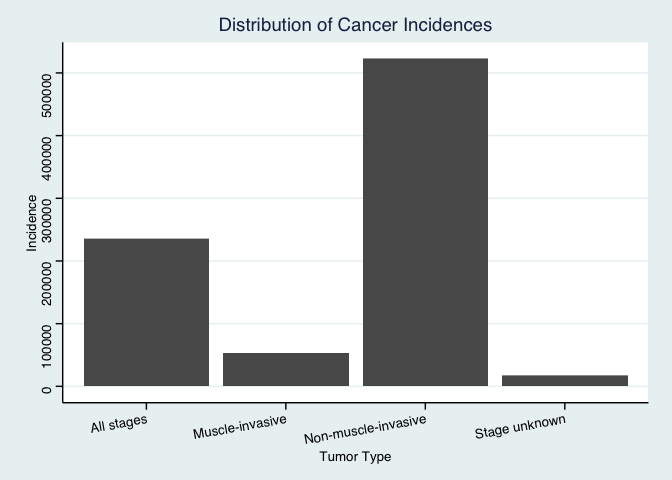<!-- -->

## The bar graph below compares cancer diagnosis survivability after 6 months depending on the type of cancer.


```r
cancer_general_data_clean$crude_survival_06m <- as.numeric(cancer_general_data_clean$crude_survival_06m)

d <- cancer_general_data_clean %>%
  group_by(tumour_type) %>%
  summarize(survival = mean(crude_survival_06m, na.rm=T))
```

```
## `summarise()` ungrouping output (override with `.groups` argument)
```

```r
d %>%
  ggplot(aes(x=tumour_type, y=survival)) + geom_col() + theme_stata() +
  labs(title = "Proportion of Cancer Patients surviving 6 months After Diagnosis",
       x = "Tumor Type",y="Proportion") +theme(axis.text.x = element_text(angle = 50, hjust = 1))
```

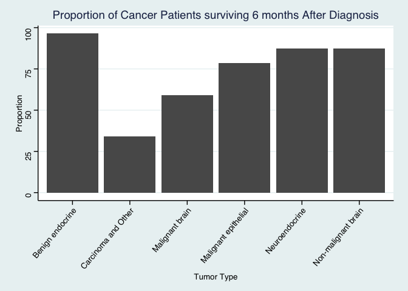<!-- -->

## The bar graph below compares cancer diagnosis survivability after 9 months depending on the type of cancer.


```r
cancer_general_data_clean$crude_survival_09m <- as.numeric(cancer_general_data_clean$crude_survival_09m)

b <- cancer_general_data_clean %>%
  group_by(tumour_type) %>%
  summarize(survival = mean(crude_survival_09m, na.rm=T))
```

```
## `summarise()` ungrouping output (override with `.groups` argument)
```

```r
b %>%
  ggplot(aes(x=tumour_type, y=survival)) + geom_col() + theme_stata() +
  labs(title = "Proportion of Cancer Patients surviving 9 months After Diagnosis",
       x = "Tumor Type",y="Proportion") +theme(axis.text.x = element_text(angle = 50, hjust = 1))
```

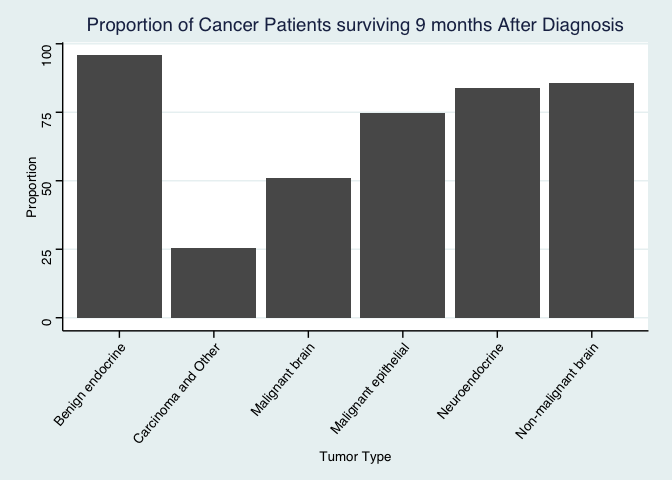<!-- -->

## The bar graph below compares cancer diagnosis survivability after 12 months depending on the type of cancer.


```r
cancer_general_data_clean$crude_survival_12m <- as.numeric(cancer_general_data_clean$crude_survival_12m)

b <- cancer_general_data_clean %>%
  group_by(tumour_type) %>%
  summarize(survival = mean(crude_survival_12m, na.rm=T))
```

```
## `summarise()` ungrouping output (override with `.groups` argument)
```

```r
b %>%
  ggplot(aes(x=tumour_type, y=survival)) + geom_col() + theme_stata() +
  labs(title = "Proportion of Cancer Patients surviving 12 months After Diagnosis",
       x = "Tumor Type",y="Proportion") +theme(axis.text.x = element_text(angle = 50, hjust = 1))
```

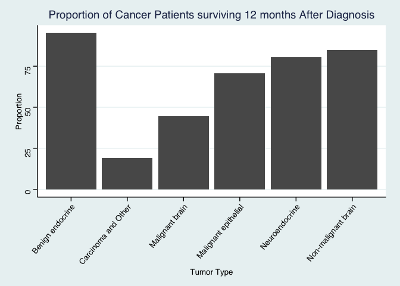<!-- -->

## The bar graph below compares cancer diagnosis survivability after 48 months depending on the type of cancer.


```r
cancer_general_data_clean$crude_survival_48m <- as.numeric(cancer_general_data_clean$crude_survival_48m)

a <- cancer_general_data_clean %>%
  group_by(tumour_type) %>%
  summarize(survival = mean(crude_survival_48m, na.rm=T))
```

```
## `summarise()` ungrouping output (override with `.groups` argument)
```

```r
a %>%
  ggplot(aes(x=tumour_type, y=survival)) + geom_col() + theme_stata() +
  labs(title = "Proportion of Cancer Patients surviving 48 months after Diagnosis",
       x = "Tumor Type",y="Proportion") +theme(axis.text.x = element_text(angle = 50, hjust = 1))
```

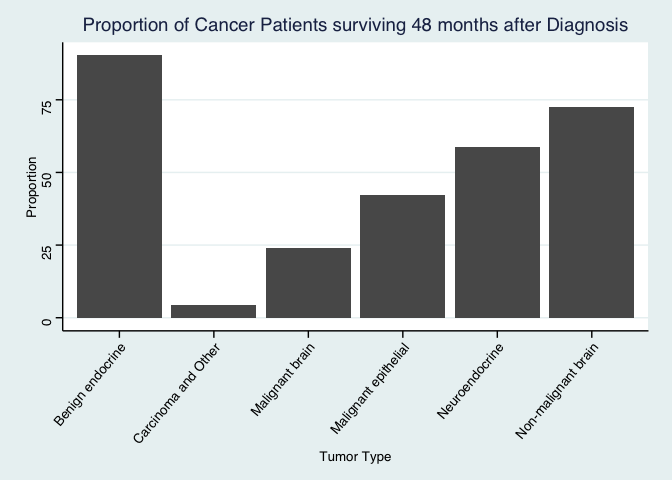<!-- -->

### The bar graph below compares cancer diagnosis survivability after 3 months depending on the type of cancer when compared to people without cancer. This provides a control setting or basis of comparison to the bar graphs above.

```r
cancer_general_data_clean$net_survival_03m <- as.numeric(cancer_general_data_clean$net_survival_03m)

b <- cancer_general_data_clean %>%
  group_by(tumour_type) %>%
  summarize(survival = mean(net_survival_03m, na.rm=T))
```

```
## `summarise()` ungrouping output (override with `.groups` argument)
```

```r
b %>%
  ggplot(aes(x=tumour_type, y=survival)) + geom_col() + theme_stata() +
  labs(title = "Proportion of Cancer Patients surviving 3 months After Diagnosis",
       x = "Tumor Type",y="Proportion") +theme(axis.text.x = element_text(angle = 50, hjust = 1))
```

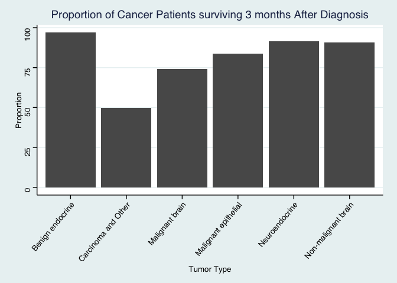<!-- -->

### In the Shiny App written for this part of the project, please refer to the file GDO_metadata.csv for the full description of the the drop-down menu items.


```r
cancer_general_data_clean$crude_survival_03m <- as.numeric(cancer_general_data_clean$crude_survival_03m)
cancer_general_data_clean$net_survival_06m <- as.numeric(cancer_general_data_clean$net_survival_06m)
cancer_general_data_clean$net_survival_09m <- as.numeric(cancer_general_data_clean$net_survival_09m)
cancer_general_data_clean$net_survival_12m <- as.numeric(cancer_general_data_clean$net_survival_12m)
cancer_general_data_clean$net_survival_48m <- as.numeric(cancer_general_data_clean$net_survival_48m)
ui <- dashboardPage(
  dashboardHeader(title = "Data Analysis"),
  dashboardSidebar(disable = T),
  dashboardBody(
  fluidRow(
  box(title = "Plot Options", width = 3,

selectInput("x", "Select Possible Factor for Cancer Survivability", choices = c("other_care_percentage", "surgery_only_percentage", "surgery_percentage", "surgery_and_rt_percentage", "ct_only_percentage", "ct_percentage"), selected = "other_care_percentage"),
  hr(),
      helpText("Please see the file 'GDO_metadata' in the data folder for full descriptions of the various factors for selection."),
  ), # close the first box
  box(title= "Factors Affecting Cancer Survivability", width = 5,
  plotOutput("plot", width = "600px", height = "600px")
  ) # close the second box
  ) # close the row
  ) # close the dashboard body
) # close the ui

server <- function(input, output, session) { 
  output$plot <- renderPlot({
  
  cancer_general_data_clean %>%
      
  ggplot(aes_string(x=input$x, y="crude_survival_03m")) + geom_point() + theme_stata() + scale_x_discrete(breaks=c(10,20,30,40,50,60,70,80,90,100))+
  labs(title = "Survivability of Cancer Diagnosis",
       x = "Percentage of Selected Criteria",y="Proportion of Cancer Patients Surviving 3 Months") +theme(axis.text.x = element_text(hjust = 1))
      
  })
  session$onSessionEnded(stopApp)
  }

shinyApp(ui, server)
```

`<div style="width: 100% ; height: 400px ; text-align: center; box-sizing: border-box; -moz-box-sizing: border-box; -webkit-box-sizing: border-box;" class="muted well">Shiny applications not supported in static R Markdown documents</div>`{=html}


### We will now analyze the incidences of a multitude of cancer types.


```r
cancer_summary <- cancer_general_data %>%
  group_by(tumour_type) %>%
  filter(grepl('Bladder|brain|Oral cavity|kidney|Benign endocrine |Carcinoma |endocrine',tumour_type)) %>%
  select(tumour_type,incidence) %>%
  group_by(tumour_type) %>%
  summarize(total_cancer = sum(incidence))
```

```
## `summarise()` ungrouping output (override with `.groups` argument)
```

```r
cancer_summary
```

```
## # A tibble: 9 x 2
##   tumour_type             total_cancer
##   <chr>                          <dbl>
## 1 Benign endocrine               24972
## 2 Bladder                      1340603
## 3 Carcinoma and Other           477698
## 4 Malignant brain               233088
## 5 Malignant kidney cancer       547955
## 6 Neuroendocrine                 12338
## 7 Non-benign endocrine            2417
## 8 Non-malignant brain           205136
## 9 Oral cavity                   113883
```


```r
cancer_summary %>%
  ggplot(aes(x = tumour_type, y=total_cancer)) +
  labs(title = "Distribution of Cancer Incidences",
       x = "Tumor Type",
       y = "Incidence")+ theme_light()+
  theme(axis.text.x = element_text(angle = 30, hjust = 1))+
  geom_col()
```

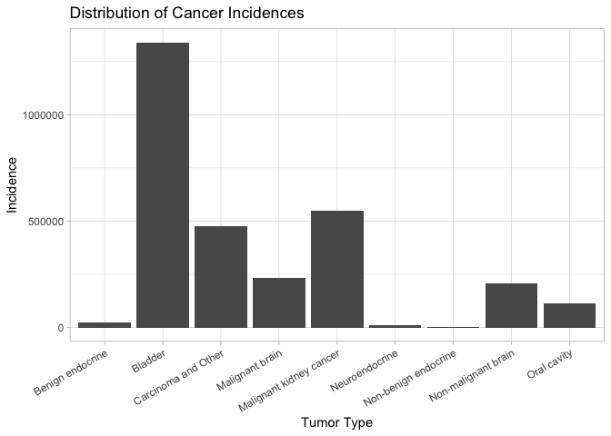<!-- -->

### We can zoom-in to details about bladder cancer.


```r
cancer_specific <- cancer_general_data %>%
  filter(tumour_type=="Bladder" & tumour_type_2!="All" & tumour_type_3!="All") %>%
  group_by(stage) %>%
  summarize(tumour_type, tumour_type_2, tumour_type_3, stage, incidence, incidence_rate) %>%
  arrange(desc(incidence_rate))
```

```
## `summarise()` regrouping output by 'stage' (override with `.groups` argument)
```

```r
cancer_specific
```

```
## # A tibble: 136 x 6
## # Groups:   stage [4]
##    stage      tumour_type tumour_type_2   tumour_type_3 incidence incidence_rate
##    <chr>      <chr>       <chr>           <chr>             <dbl>          <dbl>
##  1 All stages Bladder     Malignant and … Urothelial        16609           30.1
##  2 All stages Bladder     Malignant and … Urothelial        49280           29.7
##  3 All stages Bladder     Malignant and … Urothelial        48824           29.7
##  4 All stages Bladder     Malignant and … Urothelial        16250           29.7
##  5 All stages Bladder     Malignant and … Urothelial        16421           29.5
##  6 All stages Bladder     Malignant and … Urothelial        15965           29.4
##  7 All stages Bladder     Malignant and … Urothelial        47751           29.3
##  8 All stages Bladder     Malignant and … Urothelial        15536           28.8
##  9 Non-muscl… Bladder     Malignant and … Urothelial        12276           22.2
## 10 Non-muscl… Bladder     Malignant and … Urothelial        36038           21.8
## # … with 126 more rows
```


## This is the beginning of Jiaying's part of the project (Breast Cancer Analysis and Prognosis).


## Load the libraries

```r
library(tidyverse)
library(janitor)
options(scipen=999) #disables scientific notation when printing
library(ggthemes)
library(shiny)
library(shinydashboard)
```

## Import the breast cancer data

```r
breast_cancer <- readr::read_csv("data/METABRIC_RNA_Mutation.csv")
```

```
## Parsed with column specification:
## cols(
##   .default = col_double(),
##   type_of_breast_surgery = col_character(),
##   cancer_type = col_character(),
##   cancer_type_detailed = col_character(),
##   cellularity = col_character(),
##   `pam50_+_claudin-low_subtype` = col_character(),
##   er_status_measured_by_ihc = col_character(),
##   er_status = col_character(),
##   her2_status_measured_by_snp6 = col_character(),
##   her2_status = col_character(),
##   tumor_other_histologic_subtype = col_character(),
##   inferred_menopausal_state = col_character(),
##   integrative_cluster = col_character(),
##   primary_tumor_laterality = col_character(),
##   oncotree_code = col_character(),
##   pr_status = col_character(),
##   `3-gene_classifier_subtype` = col_character(),
##   death_from_cancer = col_character(),
##   pik3ca_mut = col_character(),
##   tp53_mut = col_character(),
##   muc16_mut = col_character()
##   # ... with 166 more columns
## )
```

```
## See spec(...) for full column specifications.
```

```
## Warning: 12 parsing failures.
##  row          col expected    actual                             file
## 1028 rasgef1b_mut a double V418A     'data/METABRIC_RNA_Mutation.csv'
## 1125 rasgef1b_mut a double S343G     'data/METABRIC_RNA_Mutation.csv'
## 1261 rasgef1b_mut a double R140Q     'data/METABRIC_RNA_Mutation.csv'
## 1261 smarcb1_mut  a double D159N     'data/METABRIC_RNA_Mutation.csv'
## 1524 rasgef1b_mut a double X2_splice 'data/METABRIC_RNA_Mutation.csv'
## .... ............ ........ ......... ................................
## See problems(...) for more details.
```

## Clean up the data (get rid of the genomics data)

```r
breast_cancer_clean <- breast_cancer %>%
  select(1:31)
view(breast_cancer_clean)
```

## Distribution of age at diagnosis (among 1904 incidences)

```r
breast_cancer_clean$age_new<-cut(breast_cancer_clean$age_at_diagnosis, seq(20,100,10))
```

```r
breast_cancer_clean %>%
  ggplot(aes(x = age_new, fill = age_new)) +
  geom_bar() +
  theme(axis.text.x = element_text(angle = 60, hjust = 1), plot.title = element_text(hjust = 0.5)) +
  labs(title = "Distribution of Age at Diagnosis",
       x = "Age Range",
       fill= "Age Range")
```

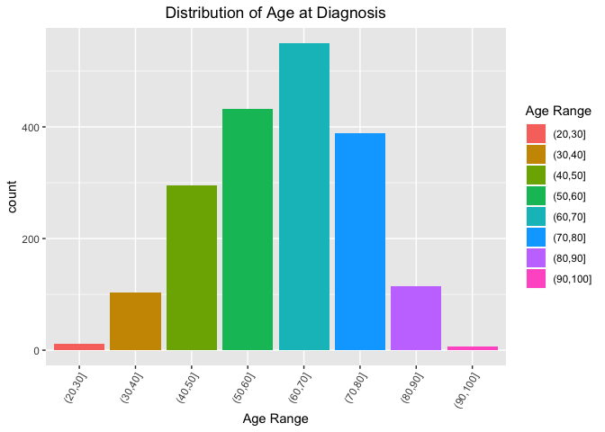<!-- -->

## Relation between age at diagnosis and overall survival rate (among 622 deaths)


```r
breast_cancer_clean %>%
  filter(death_from_cancer == "Died of Disease")
```

```
## # A tibble: 622 x 32
##    patient_id age_at_diagnosis type_of_breast_… cancer_type cancer_type_det…
##         <dbl>            <dbl> <chr>            <chr>       <chr>           
##  1          5             48.9 MASTECTOMY       Breast Can… Breast Invasive…
##  2          8             77.0 MASTECTOMY       Breast Can… Breast Mixed Du…
##  3         10             78.8 MASTECTOMY       Breast Can… Breast Invasive…
##  4         35             84.2 MASTECTOMY       Breast Can… Breast Invasive…
##  5         36             85.5 MASTECTOMY       Breast Can… Breast Invasive…
##  6         79             50.4 MASTECTOMY       Breast Can… Breast Invasive…
##  7         83             64.8 BREAST CONSERVI… Breast Can… Breast Invasive…
##  8        100             68.7 MASTECTOMY       Breast Can… Breast Invasive…
##  9        102             51.4 MASTECTOMY       Breast Can… Breast Invasive…
## 10        108             43.2 BREAST CONSERVI… Breast Can… Breast Invasive…
## # … with 612 more rows, and 27 more variables: cellularity <chr>,
## #   chemotherapy <dbl>, `pam50_+_claudin-low_subtype` <chr>, cohort <dbl>,
## #   er_status_measured_by_ihc <chr>, er_status <chr>,
## #   neoplasm_histologic_grade <dbl>, her2_status_measured_by_snp6 <chr>,
## #   her2_status <chr>, tumor_other_histologic_subtype <chr>,
## #   hormone_therapy <dbl>, inferred_menopausal_state <chr>,
## #   integrative_cluster <chr>, primary_tumor_laterality <chr>,
## #   lymph_nodes_examined_positive <dbl>, mutation_count <dbl>,
## #   nottingham_prognostic_index <dbl>, oncotree_code <chr>,
## #   overall_survival_months <dbl>, overall_survival <dbl>, pr_status <chr>,
## #   radio_therapy <dbl>, `3-gene_classifier_subtype` <chr>, tumor_size <dbl>,
## #   tumor_stage <dbl>, death_from_cancer <chr>, age_new <fct>
```


```r
breast_cancer_clean %>%
  filter(death_from_cancer == "Died of Disease") %>%
  ggplot(aes(x = age_at_diagnosis, y = overall_survival_months)) +
  geom_point(size = 1, na.rm = T) +
  theme(axis.text.x = element_text(angle = 60, hjust = 1), plot.title = element_text(hjust = 0.5)) +
  labs(title = "Age at Diagnosis vs. Overall Survival Rate in Deaths",
       x = "Age at Diagnosis",
       y = "Overall Survival Months")
```

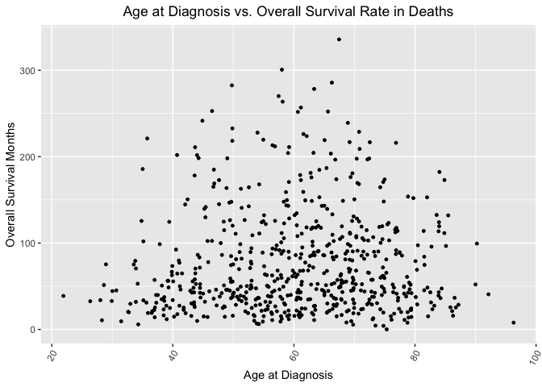<!-- -->
It is hard to tell if a linear relation exists, but from this pattern, we do have some observations: for the group 20-40, no super long survival was listed, this tends to be caused by easier recovery due to young ages; for the group 80-100, no super long suvival was listed, this tends to be caused by the rare incidences and death from other diseases.

## Comparison of survival length between treated and non-treated groups
### No further treatment received after surgery:

```r
breast_cancer_clean %>%
  select(patient_id, chemotherapy, hormone_therapy, radio_therapy, overall_survival_months, death_from_cancer) %>%
  filter(chemotherapy == "0" & hormone_therapy == "0" & radio_therapy == "0" & death_from_cancer == "Died of Disease") %>%
  summarise(avg_survival_nontreat = mean(overall_survival_months, na.rm = T))
```

```
## # A tibble: 1 x 1
##   avg_survival_nontreat
##                   <dbl>
## 1                  93.1
```
### Some further treatment received after surgery:

```r
breast_cancer_clean %>%
  select(patient_id, chemotherapy, hormone_therapy, radio_therapy, overall_survival_months, death_from_cancer) %>%
  filter(chemotherapy == "1" | hormone_therapy == "1" | radio_therapy == "1" & death_from_cancer == "Died of Disease") %>%
  summarise(avg_survival_treat = mean(overall_survival_months, na.rm = T))
```

```
## # A tibble: 1 x 1
##   avg_survival_treat
##                <dbl>
## 1               115.
```

## Build shiny app to show the relationship between overall survival months and mutation count/positive lymph nodes/tumor stage/tumor size

```r
ui <- dashboardPage(skin = "blue",
  dashboardHeader(title = "Tumor Features"),
  dashboardSidebar(disable = T),
  dashboardBody(
  fluidRow(
  box(title = "Plot Options", width = 3,
  selectInput("x", "Select Tumor Features", choices = c("tumor_size", "tumor_stage", "mutation_count", "lymph_nodes_examined_positive"), selected = "tumor_size"),
  hr(),
      helpText("Source: METABRIC database"),
  ), 
  box(title= "Tumor Features vs. Overall Survival Months", width = 5,
  plotOutput("plot", width = "500px", height = "500px")
  )
  )
  ) 
) 

server <- function(input, output, session) { 
  
  output$plot <- renderPlot({
    breast_cancer_clean %>% 
      filter(death_from_cancer == "Died of Disease") %>%
      ggplot(aes_string(x = input$x, y = "overall_survival_months")) +
      geom_point(alpha=0.9, size=2) +
      theme_grey(base_size = 18)+ labs(x="Tumor Feature", y="Overall Survival Months", fill="Fill Variable")+
      theme(axis.text.x = element_text(angle = 65, hjust = 1))
  })
  
  session$onSessionEnded(stopApp)
  }
shinyApp(ui, server)
```

`<div style="width: 100% ; height: 400px ; text-align: center; box-sizing: border-box; -moz-box-sizing: border-box; -webkit-box-sizing: border-box;" class="muted well">Shiny applications not supported in static R Markdown documents</div>`{=html}


## This is the beginning of Omar's part of the project (Mutations & Chromosome Analysis). 

## Load the libraries

```r
library(tidyverse)
library(janitor)
library(here)
library(ggthemes)
if (!require("qqman")) install.packages('qqman')
```

```
## Loading required package: qqman
```

```
## 
```

```
## For example usage please run: vignette('qqman')
```

```
## 
```

```
## Citation appreciated but not required:
```

```
## Turner, S.D. qqman: an R package for visualizing GWAS results using Q-Q and manhattan plots. biorXiv DOI: 10.1101/005165 (2014).
```

```
## 
```

```r
library(qqman)
library(dplyr)
if (!require("ggrepel")) install.packages('ggrepel')
```

```
## Loading required package: ggrepel
```

```
## Warning: package 'ggrepel' was built under R version 3.6.2
```

```r
library(ggrepel)
```


```r
#What are SNPs and why do they matter? Cancer is a conglomerate of gain-of-function of oncogenes and the loss-of-function of tumor suppressor genes. Identification of single-nucleotide polymorphisms and other mutations at important gene sites can be correlated with being cancer drivers in addition to their disease rates and severity. 
```


```r
#How do we interpret odds ratios and GWAS statistics?

#What are the odds of developing breast cancer if my Chromosome 5 - position 58804536 (rs4326095 SNP) alleles are "GA"?
```
$$
\textrm{odds if GA} = \frac{\textrm{breast cancer|GA}}{\textrm{no breast cancer|GA}} 
$$
$$
\textrm{odds if GC or AT} = \frac{\textrm{breast cancer|GC or AT}}{\textrm{no breast cancer|GC or AT}}
$$
$$
\textrm{odds ratio} = \frac{\textrm{odds if GA}}{\textrm{odds if GC or AT}} = 1.4084 
$$


```r
SNP_data <- readr::read_csv("data/SNPv2.csv")
```

```
## Parsed with column specification:
## cols(
##   `SNP ID` = col_character(),
##   `P-value` = col_double(),
##   `Chr ID` = col_double(),
##   `Chr Position` = col_double(),
##   `Submitted SNP ID` = col_character(),
##   Allele1 = col_character(),
##   Allele2 = col_character(),
##   `pHWE (case)` = col_double(),
##   `pHWE (control)` = col_double(),
##   `Call rate (case)` = col_double(),
##   `Call rate (control)` = col_double(),
##   `Odds ratio` = col_double()
## )
```

```r
SNP_data <- janitor::clean_names(SNP_data)
glimpse(SNP_data) #Association between a single SNP and breast cancer susceptibility in a group of 1,145 breast cancer patients and 1,142 controls.
```

```
## Rows: 422
## Columns: 12
## $ snp_id            <chr> "rs6549198", "rs13066342", "rs12152436", "rs6549200…
## $ p_value           <dbl> 0.4059157, 0.3738323, 0.2996095, 0.5715863, 0.56754…
## $ chr_id            <dbl> 3, 3, 3, 3, 3, 3, 3, 3, 3, 3, 3, 3, 3, 3, 3, 3, 3, …
## $ chr_position      <dbl> 69362958, 69369295, 69370395, 69373073, 69375654, 6…
## $ submitted_snp_id  <chr> "ss67470305", "ss67055138", "ss66986565", "ss674703…
## $ allele1           <chr> "A", "C", "C", "T", "C", "A", "T", "A", "A", "A", "…
## $ allele2           <chr> "G", "A", "T", "G", "T", "G", "G", "G", "G", "G", "…
## $ p_hwe_case        <dbl> 0.6186, 0.8940, 0.5629, 1.0000, 0.7863, 0.3954, 1.0…
## $ p_hwe_control     <dbl> 0.8746, 0.2215, 0.7910, 1.0000, 0.6156, 0.6674, 0.9…
## $ call_rate_case    <dbl> 0.9991266, 0.9834061, 1.0000000, 1.0000000, 1.00000…
## $ call_rate_control <dbl> 0.9973730, 0.9912434, 1.0000000, 1.0000000, 1.00000…
## $ odds_ratio        <dbl> 0.9217, 1.1340, 1.0543, 0.8855, 0.9114, 1.0380, 0.9…
```

```r
SNP_data %>%
  arrange(desc(odds_ratio))
```

```
## # A tibble: 422 x 12
##    snp_id p_value chr_id chr_position submitted_snp_id allele1 allele2
##    <chr>    <dbl>  <dbl>        <dbl> <chr>            <chr>   <chr>  
##  1 rs125… 4.14e-3     12     22976812 ss67021887       T       C      
##  2 rs432… 6.26e-4      5     58804536 ss67327073       G       A      
##  3 rs455… 5.74e-4      5     58801290 ss67345223       C       T      
##  4 rs772… 2.06e-3      5     58818721 ss67823328       C       T      
##  5 rs773… 4.92e-3      5     58838137 ss67823910       T       C      
##  6 rs116… 4.26e-2     17     48510879 ss66941285       A       G      
##  7 rs771… 2.91e-3      5     58815659 ss67821192       C       T      
##  8 rs984… 7.55e-3      3     69513197 ss67951107       C       T      
##  9 rs945… 1.30e-2      6    163721183 ss67919497       A       G      
## 10 rs187… 1.09e-2      5     58834851 ss67201344       A       G      
## # … with 412 more rows, and 5 more variables: p_hwe_case <dbl>,
## #   p_hwe_control <dbl>, call_rate_case <dbl>, call_rate_control <dbl>,
## #   odds_ratio <dbl>
```


```r
SNP_data %>%
  group_by(chr_id) %>%
  summarise(n_distinct(snp_id))
```

```
## `summarise()` ungrouping output (override with `.groups` argument)
```

```
## # A tibble: 21 x 2
##    chr_id `n_distinct(snp_id)`
##     <dbl>                <int>
##  1      1                   61
##  2      2                   28
##  3      3                   47
##  4      4                   21
##  5      5                   40
##  6      6                   21
##  7      7                   18
##  8      8                   18
##  9      9                   14
## 10     10                   15
## # … with 11 more rows
```


```r
SNP_data %>%
  ggplot(aes(x = chr_id, y=n_distinct(snp_id))) +
  labs(title = "Distribution of SNPs",
       x = "Chromosome",
       y = "SNP count")+ theme_stata()+
  theme(axis.text.x = element_text(hjust = 1))+
  geom_col(fill="green",color="black")+
  scale_x_continuous(breaks = seq(1, 21, by = 1))
```

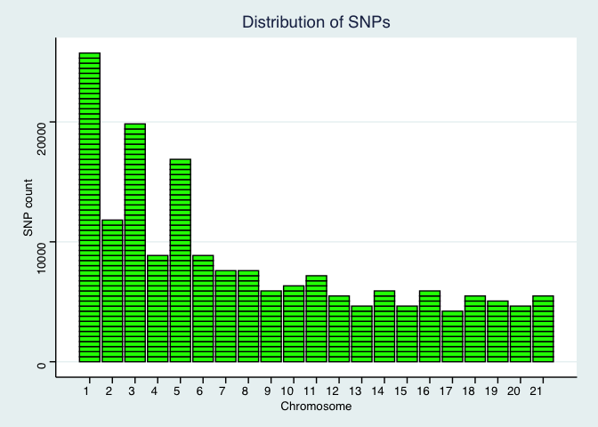<!-- -->

```r
SNP_data %>% 
  ggplot(aes(x=chr_id, fill=n_distinct(snp_id))) + geom_density(alpha=.4)
```

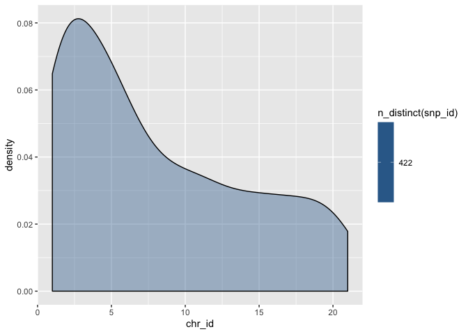<!-- -->


```r
SNP_data_causal <- SNP_data %>%
  filter(p_value<0.1)%>% #p-value from HWE testing in cases of breast cancer
  group_by(chr_id) %>%
  summarise(n_distinct(snp_id))
```

```
## `summarise()` ungrouping output (override with `.groups` argument)
```


```r
SNP_data_causal %>%
  ggplot(aes(x = chr_id, y=`n_distinct(snp_id)`)) +
  labs(title = "Distribution of SNPs with p-value <0.1",
       x = "Chromosome",
       y = "SNP count")+ theme_stata()+
  theme(axis.text.x = element_text(hjust = 1))+
  geom_col(fill="pink",color="black")
```

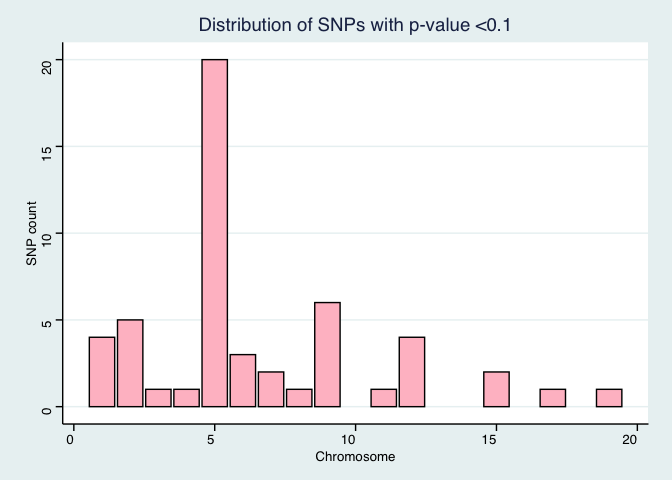<!-- -->


```r
### MANHATTAN GRAPH - too advanced to draw by hand ###
don <- gwasResults %>% 
  
  # Compute chromosome size
  group_by(CHR) %>% 
  summarise(chr_len=max(BP)) %>% 
  
  # Calculate cumulative position of each chromosome
  mutate(tot=cumsum(chr_len)-chr_len) %>%
  select(-chr_len) %>%
  
  # Add this info to the initial dataset
  left_join(gwasResults, ., by=c("CHR"="CHR")) %>%
  
  # Add a cumulative position of each SNP
  arrange(CHR, BP) %>%
  mutate( Chromosome=BP+tot) %>%

  # Add highlight and annotation information
  mutate( is_highlight=ifelse(SNP %in% snpsOfInterest, "yes", "no")) %>%
  mutate( is_annotate=ifelse(-log10(P)>4, "yes", "no")) 
```

```
## `summarise()` ungrouping output (override with `.groups` argument)
```

```r
# Prepare X axis
axisdf <- don %>% group_by(CHR) %>% summarize(center=( max(Chromosome) + min(Chromosome) ) / 2 )
```

```
## `summarise()` ungrouping output (override with `.groups` argument)
```

```r
# Make the plot
ggplot(don, aes(x=Chromosome, y=-log10(P))) +
    
    # Show all points
    geom_point( aes(color=as.factor(CHR)), alpha=0.8, size=1.3) +
    scale_color_manual(values = rep(c("grey", "skyblue"), 22 )) +
    
    # custom X axis:
    scale_x_continuous( label = axisdf$CHR, breaks= axisdf$center ) +
    scale_y_continuous(expand = c(0, 0) ) +     # remove space between plot area and x axis

    # Add highlighted points
    geom_point(data=subset(don, is_highlight=="yes"), color="orange", size=2) +

    # Custom the theme:
    theme_bw() +
    theme( 
      legend.position="none",
      panel.border = element_blank(),
      panel.grid.major.x = element_blank(),
      panel.grid.minor.x = element_blank()
    )
```

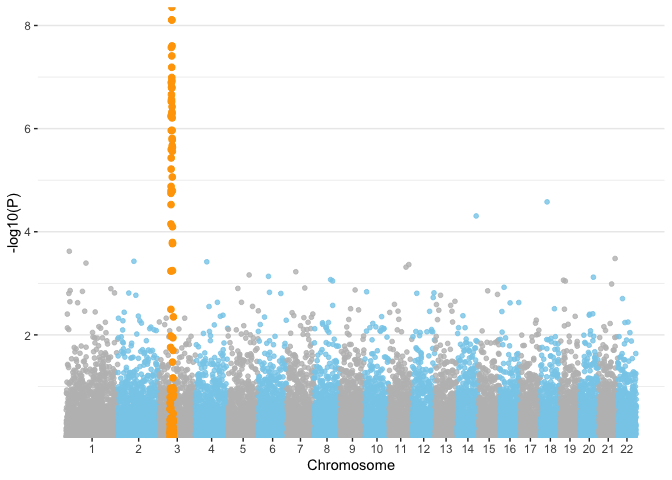<!-- -->


