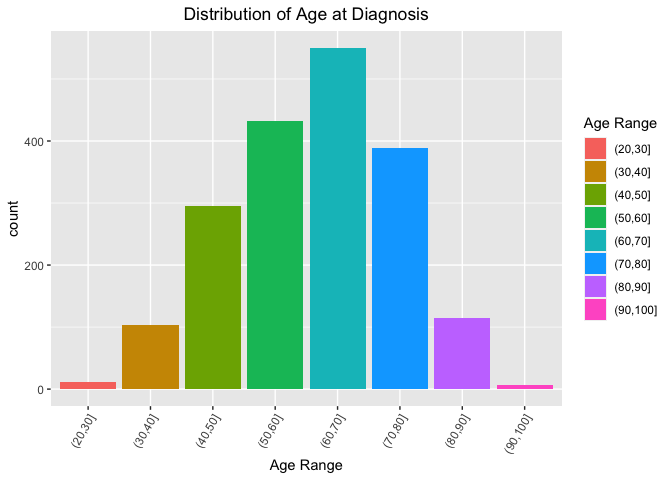
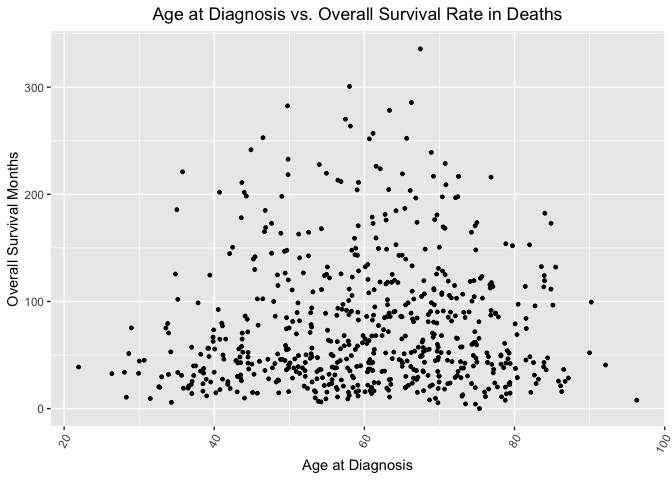

## Instructions
Answer the following questions and complete the exercises in RMarkdown. Please embed all of your code and push your final work to your repository. Your code should be organized, clean, and run free from errors. Be sure to **add your name** to the author header above. You may use any resources to answer these questions (including each other), but you may not post questions to Open Stacks or external help sites. There are 10 total questions.  

Make sure to use the formatting conventions of RMarkdown to make your report neat and clean! Your plots should use consistent aesthetics throughout. Feel free to be creative- there are many possible solutions to these questions!  


## Load the libraries

```r
library(tidyverse)
```

```
## ── Attaching packages ─────────────────────────────────────── tidyverse 1.3.0 ──
```

```
## ✓ ggplot2 3.3.3     ✓ purrr   0.3.4
## ✓ tibble  3.0.4     ✓ dplyr   1.0.2
## ✓ tidyr   1.1.2     ✓ stringr 1.4.0
## ✓ readr   1.4.0     ✓ forcats 0.5.0
```

```
## ── Conflicts ────────────────────────────────────────── tidyverse_conflicts() ──
## x dplyr::filter() masks stats::filter()
## x dplyr::lag()    masks stats::lag()
```

```r
library(janitor)
```

```
## 
## Attaching package: 'janitor'
```

```
## The following objects are masked from 'package:stats':
## 
##     chisq.test, fisher.test
```

```r
options(scipen=999) #disables scientific notation when printing
library(ggthemes)
library(shiny)
library(shinydashboard)
```

```
## 
## Attaching package: 'shinydashboard'
```

```
## The following object is masked from 'package:graphics':
## 
##     box
```

## Import the breast cancer data

```r
breast_cancer <- readr::read_csv("data/METABRIC_RNA_Mutation.csv")
```

```
## 
## ── Column specification ────────────────────────────────────────────────────────
## cols(
##   .default = col_double(),
##   type_of_breast_surgery = col_character(),
##   cancer_type = col_character(),
##   cancer_type_detailed = col_character(),
##   cellularity = col_character(),
##   `pam50_+_claudin-low_subtype` = col_character(),
##   er_status_measured_by_ihc = col_character(),
##   er_status = col_character(),
##   her2_status_measured_by_snp6 = col_character(),
##   her2_status = col_character(),
##   tumor_other_histologic_subtype = col_character(),
##   inferred_menopausal_state = col_character(),
##   integrative_cluster = col_character(),
##   primary_tumor_laterality = col_character(),
##   oncotree_code = col_character(),
##   pr_status = col_character(),
##   `3-gene_classifier_subtype` = col_character(),
##   death_from_cancer = col_character(),
##   pik3ca_mut = col_character(),
##   tp53_mut = col_character(),
##   muc16_mut = col_character()
##   # ... with 166 more columns
## )
## ℹ Use `spec()` for the full column specifications.
```

```
## Warning: 12 parsing failures.
##  row          col expected    actual                             file
## 1028 rasgef1b_mut a double V418A     'data/METABRIC_RNA_Mutation.csv'
## 1125 rasgef1b_mut a double S343G     'data/METABRIC_RNA_Mutation.csv'
## 1261 rasgef1b_mut a double R140Q     'data/METABRIC_RNA_Mutation.csv'
## 1261 smarcb1_mut  a double D159N     'data/METABRIC_RNA_Mutation.csv'
## 1524 rasgef1b_mut a double X2_splice 'data/METABRIC_RNA_Mutation.csv'
## .... ............ ........ ......... ................................
## See problems(...) for more details.
```

## Clean up the data (get rid of the genomics data)

```r
breast_cancer_clean <- breast_cancer %>%
  select(1:31)
view(breast_cancer_clean)
```

## Distribution of age at diagnosis (among 1904 incidences)

```r
breast_cancer_clean$age_new<-cut(breast_cancer_clean$age_at_diagnosis, seq(20,100,10))
```

```r
breast_cancer_clean %>%
  ggplot(aes(x = age_new, fill = age_new)) +
  geom_bar() +
  theme(axis.text.x = element_text(angle = 60, hjust = 1), plot.title = element_text(hjust = 0.5)) +
  labs(title = "Distribution of Age at Diagnosis",
       x = "Age Range",
       fill= "Age Range")
```

<!-- -->

## Relation between age at diagnosis and overall survival rate (among 622 deaths)


```r
breast_cancer_clean %>%
  filter(death_from_cancer == "Died of Disease")
```

```
## # A tibble: 622 x 32
##    patient_id age_at_diagnosis type_of_breast_… cancer_type cancer_type_det…
##         <dbl>            <dbl> <chr>            <chr>       <chr>           
##  1          5             48.9 MASTECTOMY       Breast Can… Breast Invasive…
##  2          8             77.0 MASTECTOMY       Breast Can… Breast Mixed Du…
##  3         10             78.8 MASTECTOMY       Breast Can… Breast Invasive…
##  4         35             84.2 MASTECTOMY       Breast Can… Breast Invasive…
##  5         36             85.5 MASTECTOMY       Breast Can… Breast Invasive…
##  6         79             50.4 MASTECTOMY       Breast Can… Breast Invasive…
##  7         83             64.8 BREAST CONSERVI… Breast Can… Breast Invasive…
##  8        100             68.7 MASTECTOMY       Breast Can… Breast Invasive…
##  9        102             51.4 MASTECTOMY       Breast Can… Breast Invasive…
## 10        108             43.2 BREAST CONSERVI… Breast Can… Breast Invasive…
## # … with 612 more rows, and 27 more variables: cellularity <chr>,
## #   chemotherapy <dbl>, `pam50_+_claudin-low_subtype` <chr>, cohort <dbl>,
## #   er_status_measured_by_ihc <chr>, er_status <chr>,
## #   neoplasm_histologic_grade <dbl>, her2_status_measured_by_snp6 <chr>,
## #   her2_status <chr>, tumor_other_histologic_subtype <chr>,
## #   hormone_therapy <dbl>, inferred_menopausal_state <chr>,
## #   integrative_cluster <chr>, primary_tumor_laterality <chr>,
## #   lymph_nodes_examined_positive <dbl>, mutation_count <dbl>,
## #   nottingham_prognostic_index <dbl>, oncotree_code <chr>,
## #   overall_survival_months <dbl>, overall_survival <dbl>, pr_status <chr>,
## #   radio_therapy <dbl>, `3-gene_classifier_subtype` <chr>, tumor_size <dbl>,
## #   tumor_stage <dbl>, death_from_cancer <chr>, age_new <fct>
```


```r
breast_cancer_clean %>%
  filter(death_from_cancer == "Died of Disease") %>%
  ggplot(aes(x = age_at_diagnosis, y = overall_survival_months)) +
  geom_point(size = 1, na.rm = T) +
  theme(axis.text.x = element_text(angle = 60, hjust = 1), plot.title = element_text(hjust = 0.5)) +
  labs(title = "Age at Diagnosis vs. Overall Survival Rate in Deaths",
       x = "Age at Diagnosis",
       y = "Overall Survival Months")
```

<!-- -->
It is hard to tell if a linear relation exists, but from this pattern, we do have some observations: for the group 20-40, no super long survival was listed, this tends to be caused by easier recovery due to young ages; for the group 80-100, no super long suvival was listed, this tends to be caused by the rare incidences and death from other diseases.

## Comparison of survival length between treated and non-treated groups
### No further treatment received after surgery:

```r
breast_cancer_clean %>%
  select(patient_id, chemotherapy, hormone_therapy, radio_therapy, overall_survival_months, death_from_cancer) %>%
  filter(chemotherapy == "0" & hormone_therapy == "0" & radio_therapy == "0" & death_from_cancer == "Died of Disease") %>%
  summarise(avg_survival_nontreat = mean(overall_survival_months, na.rm = T))
```

```
## # A tibble: 1 x 1
##   avg_survival_nontreat
##                   <dbl>
## 1                  93.1
```
### Some further treatment received after surgery:

```r
breast_cancer_clean %>%
  select(patient_id, chemotherapy, hormone_therapy, radio_therapy, overall_survival_months, death_from_cancer) %>%
  filter(chemotherapy == "1" | hormone_therapy == "1" | radio_therapy == "1" & death_from_cancer == "Died of Disease") %>%
  summarise(avg_survival_treat = mean(overall_survival_months, na.rm = T))
```

```
## # A tibble: 1 x 1
##   avg_survival_treat
##                <dbl>
## 1               115.
```

## Build shiny app to show the relationship between overall survival months and mutation count/positive lymph nodes/tumor stage/tumor size

```r
ui <- dashboardPage(skin = "blue",
  dashboardHeader(title = "Tumor Features"),
  dashboardSidebar(disable = T),
  dashboardBody(
  fluidRow(
  box(title = "Plot Options", width = 3,
  selectInput("x", "Select Tumor Features", choices = c("tumor_size", "tumor_stage", "mutation_count", "lymph_nodes_examined_positive"), selected = "tumor_size"),
  hr(),
      helpText("Source: METABRIC database"),
  ), 
  box(title= "Tumor Features vs. Overall Survival Months", width = 5,
  plotOutput("plot", width = "500px", height = "500px")
  )
  )
  ) 
) 

server <- function(input, output, session) { 
  
  output$plot <- renderPlot({
    breast_cancer_clean %>% 
      filter(death_from_cancer == "Died of Disease") %>%
      ggplot(aes_string(x = input$x, y = "overall_survival_months")) +
      geom_point(alpha=0.9, size=2) +
      theme_grey(base_size = 18)+ labs(x="Tumor Feature", y="Overall Survival Months", fill="Fill Variable")+
      theme(axis.text.x = element_text(angle = 65, hjust = 1))
  })
  
  session$onSessionEnded(stopApp)
  }
shinyApp(ui, server)
```

`<div style="width: 100% ; height: 400px ; text-align: center; box-sizing: border-box; -moz-box-sizing: border-box; -webkit-box-sizing: border-box;" class="muted well">Shiny applications not supported in static R Markdown documents</div>`{=html}


